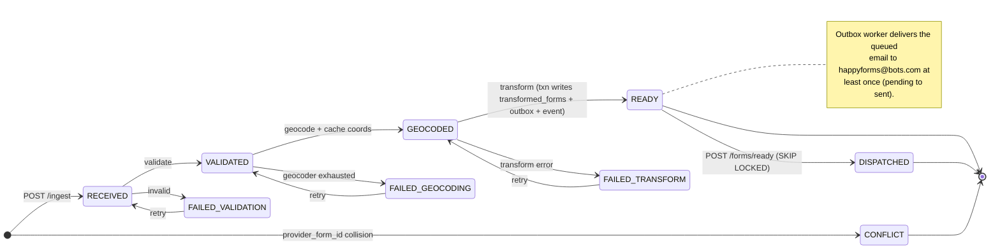
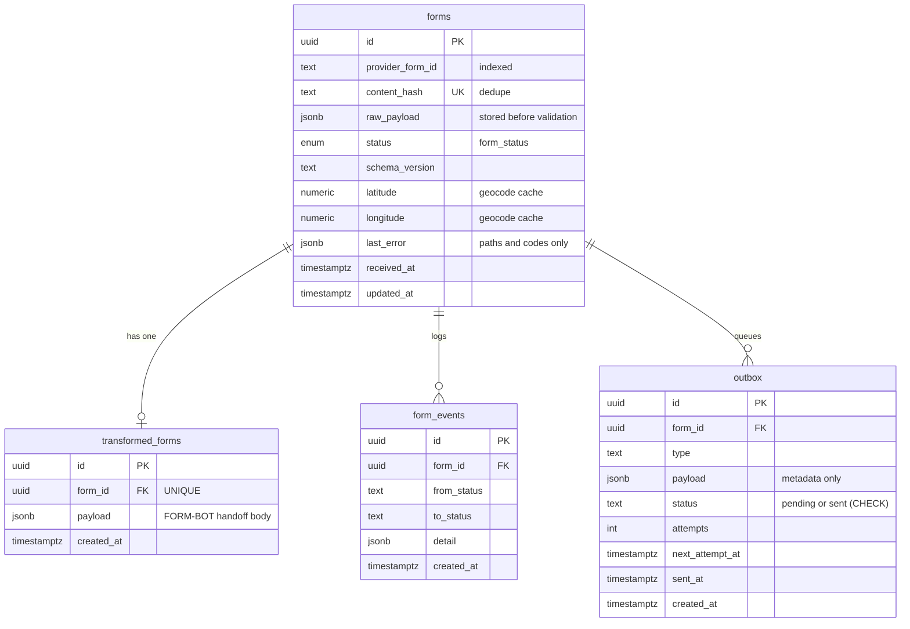

# Architecture

Two views of the system: the **form lifecycle** (the status column is the work queue; every arrow is a
compare-and-swap transition that also writes a `form_events` row) and the **entity model**.

Schema and migrations live in [`src/db/schema.ts`](../src/db/schema.ts) and [`drizzle/`](../drizzle). Field
shapes are pinned by the provided source-of-truth types
[`src/forms/schemas/ingested_schema.ts`](../src/forms/schemas/ingested_schema.ts) and
[`src/forms/schemas/transformed_schema.ts`](../src/forms/schemas/transformed_schema.ts).

## Form lifecycle

`POST /ingest` stores the raw payload and dedupes it by `content_hash`; the pipeline **runner**
(fired-and-forgotten on ingest and retry) and the **sweeper** (crash recovery) then advance the status.
`GEOCODED → READY` writes the transformed row, the outbox email row, and the status flip in a single
transaction. `READY → DISPATCHED` is the FORM-BOT claim under `FOR UPDATE SKIP LOCKED`. Failures quarantine
and are replayed by `POST /forms/:id/retry`, which resets a form to the step that failed.

Terminal statuses: `READY` (terminal for the pipeline), `DISPATCHED`, `CONFLICT`, and the three `FAILED_*`
(terminal until retried).

## Entity model

`forms` is the spine; the other three tables hang off it. `content_hash` is the `UNIQUE` dedupe key;
`transformed_forms` is 1:1 (the FORM-BOT handoff body); `form_events` is the append-only audit trail;
`outbox` is the transactional-outbox table for the guaranteed email.

All three background loops (`src/pipeline/run.ts`, `src/pipeline/sweeper.ts`, `src/outbox/worker.ts`,
started in `src/index.ts`) are plain Postgres pollers — there is no external queue or broker.
